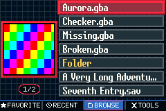
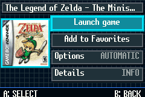
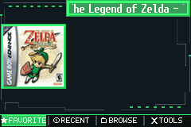
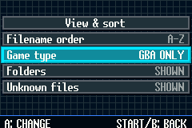

# SuperR7

<p align="center">
  
</p>

<p align="center">
  <strong>YOUR SUPERCARD. POWERED UP. TO THE EXTREME.</strong>
</p>


SuperR7 is an independent, GPL-licensed fork of
[SuperFW](https://github.com/davidgfnet/superfw) for **SuperCard SD and
SuperChis GBA flash carts**. Luna 1.2 RC1 is based on **SuperFW v0.21, the
latest upstream SuperFW firmware release**. Underneath the extreme attitude is
the proven SuperFW engine. Up front is a whole new cover-powered game library
built for the GBA's 240-by-160 screen.

## 41,160 ways to make it yours

Build your look from three independently selectable color roles:

- **Background** — the foundation of the interface.
- **Accent** — dividers, details, and active interface elements.
- **Selection** — highlighted cards, cover borders, dock highlights, and the
  Browse page pill.

Each role can use any of **14 colors**: Black, Charcoal, Slate, Navy, Teal,
Burgundy, Cyan, Blue, Purple, Red, Amber, Green, Ice, or White. Combine them
with **five wallpapers**—None, Weave, Grid, Circuit, and Tech Frame—and three
contrast modes: Auto, Dark, or Light.


Want a great look immediately? Start with one of four built-in presets:
**Electric Blue**, **Mutant Green**, **Stealth Black**, or **Chrome Silver**.


SuperR7 doesn't just show your games. It **unleashes** them.

- **DUAL-CART POWER!** Run board-specific builds on SuperCard SD or SuperChis
  GBA flash carts.
- **MEGA-SIZED COVER POWER!** See native 76-by-76 `.sfcov` box art.
- **SEVEN-GAME ATTACK!** Pack seven cover-focused game rows with long-title
  support onto every page.
- **TURBO PAGE ACTION!** Tap Left or Right to jump a full page. Hold the
  button in Browse and the pages accelerate.
- **THE FOUR-WAY POWER DOCK!** Hit Favorites, Recent, Browse, or Tools.
- **FAVORITES!** Save up to 200 favorites. 
- **SORT IT. FILTER IT. OWN IT!** Browse A–Z or Z–A, choose GBA/GB/GBC, and
  hide folders or unknown extensions. Your choices survive a reboot.
- **QUICK LAUNCH!** Launch immediately or charge into Options,
  Advanced, and Details.
- **MAXIMUM CUSTOMIZATION!** Mix 14 Background, Accent, and Selection colors
  with five wallpapers and three contrast modes for 41,160 configurations.
- **IN-GAME STYLE OVERDRIVE!** Your colors and wallpaper follow you into the
  in-game menu.


## Witness the power

| Seven-game cover assault | Quick Launch impact |
| :---: | :---: |
|  |  |
| **Match your Game Boy: 41,160 ways to make it yours** | **Filter Your catalog** |
|  |  |
| **Make it yours** | **Matching in-game menu** |
|  |  |

SuperFW supplies the proven foundation. SuperR7 cranks the game-library
experience to eleven.

SuperR7 preserves SuperFW's features, GPL license, credits, and compatible
`/.superfw/` SD-card layout so your save files can come along.  The projects have different interfaces,
roadmaps, and releases.

## Add the awesome with SuperCover


[**SuperCover**](https://github.com/dnunezx/SuperCover) turns your ROM folder
into a SuperR7-ready cover collection:

1. Pick your GBA ROM folder.
2. Review the artwork matches.
3. Export to `/.superfw/covers/` on your SuperCard SD.

**PICK. REVIEW. EXPORT. BOOM.** SuperCover scans your ROMs, creates SuperR7's
76-by-76 cover files, and gives them the filenames the firmware expects.

### The almost-magic part

SuperR7's production **SFCV v3** cover format was custom-made exclusively for
SuperR7. Making cover art work took far more than shrinking a picture: it
required a new 76-by-76 binary format, careful GBA palette allocation, color
conversion to BGR555, indexed-pixel encoding, CRC-32 protection, strict file
validation, safe filename matching, a responsive firmware loader and cache,
desktop conversion tools, emulator tests, and repeated testing on real
SuperCard SD hardware.

Want total control? Take the manual route with the included
[cover converter](docs/cover-converter.md).

## Original power under the hood

The attitude is new. The serious firmware technology is battle-tested.
SuperR7 retains SuperFW's major features:

- SDHC and exFAT support.
- WAITCNT, save, IRQ, and RTC patching.
- SRAM save protection and optional Direct-Saving.
- In-game saves, savestates, cheats, reset, RTC, and return-to-menu.
- Game Boy and Game Boy Color emulation through Goomba Color.
- Per-game settings, patch cache, cheat files, and emulator support.

## Master the controls

| Button | Extreme library action |
| --- | --- |
| Up / Down | Strike the previous or next game |
| Left / Right | Blast to the previous or next seven-game page; hold to accelerate in Browse |
| A | Unleash Quick Launch |
| B | Retreat to the previous screen |
| Start | Activate View & Sort in Browse |


## Back up and test before you flash

Firmware is board-specific. Confirm whether the image says `SD` or `Chis`,
back up the cart's current firmware, and chain-load the `.gba` before using the
identical `.fw` image for an internal-flash installation. Never put an SD build
on SuperChis or a Chis build on SuperCard SD.

## Get the power

Versioned firmware downloads belong on
[GitHub Releases](https://github.com/dnunezx/SuperR7/releases). Verify the
published checksum, chain-load the `.gba` file, and test it on your hardware
before considering an internal-flash installation.

Need installation or recovery details? Use the inherited
[SuperFW installation guide](https://superfw.davidgf.net/docs/install/flash/).

Games, SuperCard SD hardware, and the Game Boy Advance are not included.

## Build your own beast

```sh
make BOARD=sd COMPRESSION_RATIO=10 superr7.gba
make BOARD=chis COMPRESSION_RATIO=10 superr7.gba
```

Each command outputs `superr7.gba`; move or rename the first output before
building the other board. Building is not hardware validation—test every new
image. See the [SuperChis hardware test](docs/superchis-hardware-test.md) for
the safe chain-load-first sequence.

## Enter the SuperR7 command center

- [Interface and controls](docs/interface.md)
- [Cover format](docs/cover-format.md)
- [Documentation index](docs/README.md)
- [Development history](docs/history/README.md)

## Credits and license

SuperR7-specific work was done by **Danny Nunez (dnunezx)**.
SuperR7 is based on SuperFW, primarily written by **David Guillen Fandos
(davidgf)**. Upstream authorship and copyright notices are preserved.

Licensed under the **GNU General Public License, version 3 or later**. See
[LICENSE](LICENSE) and [CREDITS.md](CREDITS.md).

---

<p align="center">
  <strong>SUPER R7!</strong><br>
  <em>More covers. More control. More power. EXTREME!</em>
</p>
